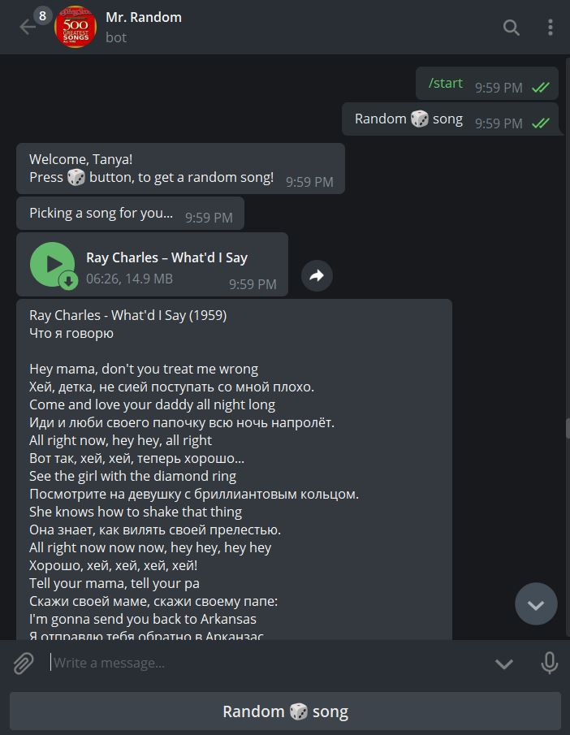

# thanksAbot
Telegram bot https://t.me/thanksAbot
## Overview

I wrote this bot to automate song picking process as an additional tool for those who learn English. You press the button, 
thanksAbot gives you a random song and its lyrics from the "500 Greatest Songs of all time" according to the Rolling Stone magazine, 
you listen the song, train your listening skill and learn new words.


## Language

Eng - Rus

## Who will like it

Russians learning English, as well as English-speaking users who learn Russian language. 

Fans of this album of course)

## Screenshot



## Libraries stack
```python
import telebot
import pyTelegramBotAPI
import os
import random
from datetime import datetime
from flask import Flask, request

import constants
import lyrics
```

Where constants is constants.py with TOKEN (hidden) and lyrics is lyrics.py which contains all lyrics and translation to Rissian.

## Contributing
Pull requests are welcome. For major changes, please open an issue first to discuss what you would like to change.

## License
[MIT](https://choosealicense.com/licenses/mit/)
